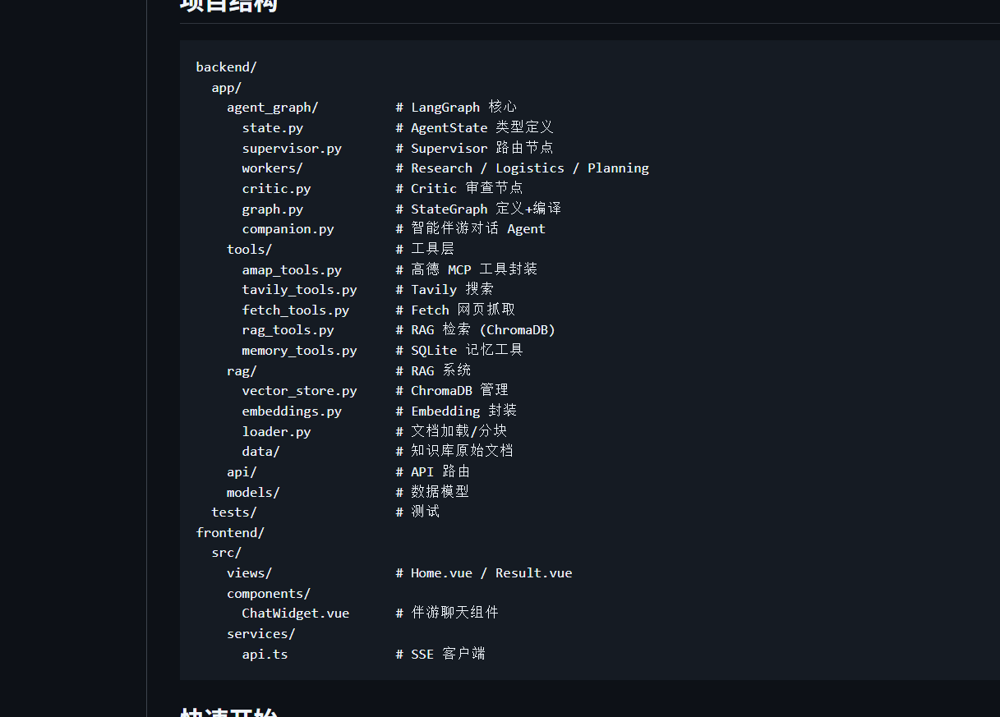

backend/
  app/
    agent_graph/          # LangGraph 核心
      state.py            # AgentState 类型定义
      supervisor.py       # Supervisor 路由节点
      workers/            # Research / Logistics / Planning
      critic.py           # Critic 审查节点
      graph.py            # StateGraph 定义+编译
      companion.py        # 智能伴游对话 Agent
    tools/                # 工具层
      amap_tools.py       # 高德 MCP 工具封装
      tavily_tools.py     # Tavily 搜索
      fetch_tools.py      # Fetch 网页抓取
      rag_tools.py        # RAG 检索 (ChromaDB)
      memory_tools.py     # SQLite 记忆工具
    rag/                  # RAG 系统
      vector_store.py     # ChromaDB 管理
      embeddings.py       # Embedding 封装
      loader.py           # 文档加载/分块
      data/               # 知识库原始文档
    api/                  # API 路由
    models/               # 数据模型
  tests/                  # 测试
frontend/
  src/
    views/                # Home.vue / Result.vue
    components/
      ChatWidget.vue      # 伴游聊天组件
    services/
      api.ts              # SSE 客户端

这是智能伴游对话 Agent，独立实现一套 ReAct 工具调用循环，不依赖 StateGraph，用于和用户聊天问答行程、调用高德、RAG、搜索工具，输出 SSE 流式结果给前端 Vue。
整体流程：
初始化接收 LLM、工具集合、JSON 行程数据
把行程 JSON 转换成文本上下文，塞进 SystemPrompt
chat_stream()对外接口，接收用户消息，执行 ReAct 循环最多 8 轮
LLM 输出工具调用 → 执行工具，把 ToolMessage 塞回消息列表继续循环
LLM 不再调用工具，就流式返回最终回答；超过最大迭代强制输出答案
维护内存对话历史，做裁剪，保存 Human/AIMessage